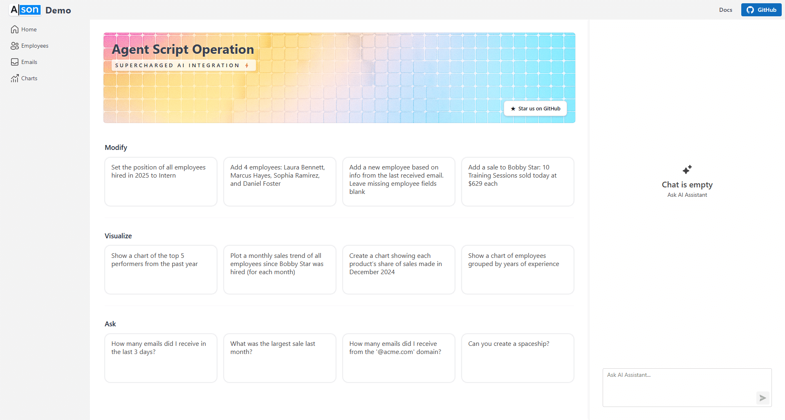

# ASON Demo

This repository contains the [ASON online demo](https://ason-demo-web--app-resource-cecsbjgqamhmfzcf.centralus-01.azurewebsites.net/). To learn more about ASON, refer to the main [ASON repository](https://github.com/Alexgoon/ason).

## Running the Demo

While ASON is a fully open-source and free library, the demo requires a few additional products/services to run on your machine:

- **OpenAI**: You’ll need an [OpenAI API key](https://platform.openai.com/api-keys). You can either add it to the `MY_OPEN_AI_KEY` environment variable or use it directly in the `Program.cs` file.  
- **DevExpress**: The demo uses [DevExpress Blazor components](https://www.devexpress.com/blazor/) for the UI. To build it, you need a DevExpress subscription or a [free trial account](https://www.devexpress.com/Products/Try/) with a configured [DevExpress NuGet feed](https://nuget.devexpress.com/). The easiest way to set this up is through the DevExpress installer.

